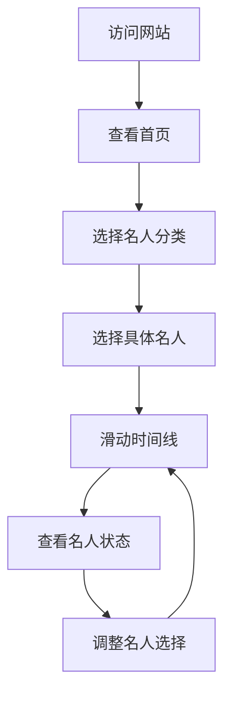

## 1. Product Overview
历史年轮网页项目是一个可视化历史名人时间线的交互式网页应用，用户可以通过滑动年份时间查看所选名人的出生、在世和离世情况。
- 解决用户直观了解历史名人时间分布的问题，为历史爱好者和教育工作者提供便捷的历史时间线工具。
- 目标用户包括历史爱好者、教育工作者、学生等对历史人物时间线感兴趣的人群。

## 2. Core Features

### 2.1 User Roles (if applicable)
| Role | Registration Method | Core Permissions |
|------|---------------------|------------------|
| Normal User | No registration required | Browse and use all features |

### 2.2 Feature Module
1. **Home page**: hero section,名人选择界面, 时间线交互界面
2. **About page**: 项目介绍, 使用说明

### 2.3 Page Details
| Page Name | Module Name | Feature description |
|-----------|-------------|---------------------|
| Home page | Hero section | 项目标题、简短介绍，引导用户开始使用 |
| Home page | 名人选择界面 | 提供名人分类筛选，用户可以选择多个历史名人 |
| Home page | 时间线交互界面 | 可滑动的年份时间线，显示所选名人的出生、在世和离世状态，支持缩放和拖拽操作 |
| About page | 项目介绍 | 介绍项目背景、功能和使用方法 |

## 3. Core Process
用户访问网站 → 选择历史名人分类 → 选择具体名人 → 滑动时间线查看名人状态变化 → 可随时调整选择的名人

## 4. User Interface Design
### 4.1 Design Style
- 主色调：深蓝色 (#1a237e) 和金色 (#ffd700)，体现历史的厚重感和尊贵感
- 次要色调：浅灰色 (#f5f5f5) 作为背景，深灰色 (#333333) 作为文本
- 按钮样式：圆角矩形，悬停时有轻微的阴影和颜色变化
- 字体：标题使用 serif 字体（如 Georgia），正文使用 sans-serif 字体（如 Inter）
- 布局风格：卡片式布局，清晰的视觉层次，响应式设计
- 图标风格：简约线条风格，使用历史相关的图标元素

### 4.2 Page Design Overview
| Page Name | Module Name | UI Elements |
|-----------|-------------|-------------|
| Home page | Hero section | 大型标题 "历史年轮"，简短介绍文字，背景使用历史纹理或渐变效果 |
| Home page | 名人选择界面 | 分类标签（如科学家、艺术家、政治家等），名人列表卡片，多选功能 |
| Home page | 时间线交互界面 | 水平可滑动时间轴，年份标记，名人状态指示器（出生、在世、离世），状态变化动画 |
| About page | 项目介绍 | 项目背景、功能说明、使用指南，图文结合 |

### 4.3 Responsiveness
- 采用桌面优先设计，同时支持平板和移动设备
- 在移动设备上，时间线可垂直滚动，名人选择界面调整为更紧凑的布局
- 触摸设备优化：支持触摸滑动和缩放操作

### 4.4 3D Scene Guidance (if applicable)
- 不适用 3D 场景