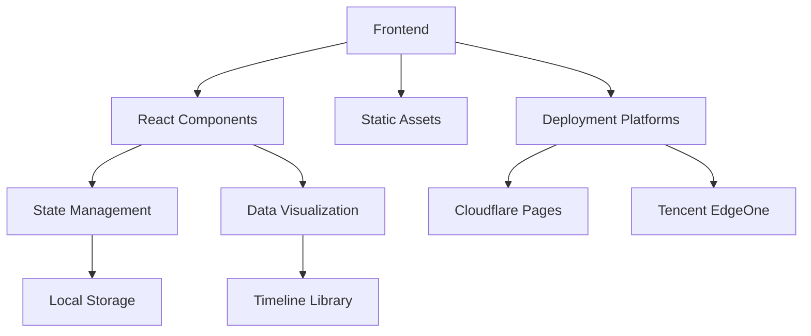
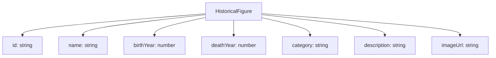

## 1. Architecture Design


## 2. Technology Description
- Frontend: React@18 + TypeScript + Tailwind CSS@3 + Vite
- Initialization Tool: Vite
- Backend: None (static site)
- Data Storage: Local JSON files for historical figures data
- Deployment: Cloudflare Pages, Tencent EdgeOne
- Timeline Library: react-horizontal-timeline or custom implementation
- State Management: Zustand (lightweight state management)

## 3. Route Definitions
| Route | Purpose |
|-------|---------|
| / | Home page with timeline and celebrity selection |
| /about | About page with project information |

## 4. API Definitions (if backend exists)
- No backend API required. All data is stored locally in JSON files.

## 5. Server Architecture Diagram (if backend exists)
- Not applicable for static site

## 6. Data Model
### 6.1 Data Model Definition


### 6.2 Data Definition Language
- JSON file structure for historical figures:

```json
[
  {
    "id": "newton",
    "name": "Isaac Newton",
    "birthYear": 1643,
    "deathYear": 1727,
    "category": "scientist",
    "description": "English mathematician, physicist, astronomer, alchemist, theologian, and author",
    "imageUrl": "https://example.com/newton.jpg"
  },
  {
    "id": "einstein",
    "name": "Albert Einstein",
    "birthYear": 1879,
    "deathYear": 1955,
    "category": "scientist",
    "description": "German-born theoretical physicist who developed the theory of relativity",
    "imageUrl": "https://example.com/einstein.jpg"
  }
]
```

- Categories:
  - scientist: 科学家
  - artist: 艺术家
  - politician: 政治家
  - philosopher: 哲学家
  - writer: 作家
  - musician: 音乐家